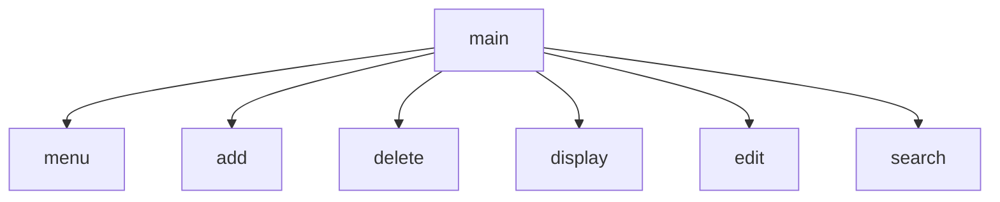

# Chapter-6-Group-Project
Jamie, Anthony, Evan
## Contact Manager
The contact manager is a program that will consist of 7 functions that will help you manage the name, street address, phone number, and email.
## contact manager Flowchart

#### Function Diagrams

***
| `main()`    |               |   Jamie     |
| ------------------ | ------------- | ----------- |
| ``    | takes input for what  |              |
| `    | what it does  | what it outputs         |
***
| `menu()`    |               |   Anthony     |
| ------------------ | ------------- | ----------- |
| ``    | takes input from the user  |              |
| `    | it lists the contacts | it outputs the contacts |
***
| `add()`    |               |   Evan     |
| ------------------ | ------------- | ----------- |
| ``    | takes input for what  | add up to 7 contacts |
| `    | what it does  | what it outputs  the contacts |
***
| `edit()`    |               |   Evan     |
| ------------------ | ------------- | ----------- |
| ``    | takes input for what  |whatever you want to edit |
| `    | what it does  | what it outputs  you can change it |
***
| `delete()`    |               |   Evan     |
| ------------------ | ------------- | ----------- |
| ``    | takes input for what  | type contact to delete |
| `    | what it does  | what it outputs   deleted/erased contact |
***
| `search()`    |               |   Anthony     |
| ------------------ | ------------- | ----------- |
| ``    | takes input the user  |              |
| `    | gives contact number  | it outputs what the user seaches for |
***
| `display()`    |               |   Jamie     |
| ------------------ | ------------- | ----------- |
| ``    | takes input for what  |              |
| `    | what it does  | what it outputs         |
