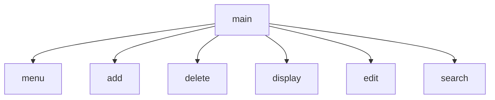

# Chapter-6-Group-Project
Jamie, Anthony, Evan
## Contact Manager
The contact manager is a program that will consist of 7 functions that will help you manage the name, street address, phone number, and email. Menu will displays the menu and take the input on the choice. Main will take the user choice and call the function. Add contact will add a new contact to the file holding the contacts. Edit contact will take a contact from the file holding contacts and change it and push it back the file. Delete contact will remove a contact from the file. Search will allow the user to look up a contact from the file. And display will display all of the contacts on the file.
## contact manager Flowchart

#### Function Diagrams

***
| `main()`    |               |   Jamie     |
| ------------------ | ------------- | ----------- |
| ``    | takes input from menu choice  |              |
| `    | calls the function from menu | outputs the function         |
***
| `menu()`    |               |   Anthony     |
| ------------------ | ------------- | ----------- |
| ``    | takes input from the user  |   returns menu choice           |
| `    | it lists the contacts | it outputs the contacts |
***
| `add()`    |               |   Evan     |
| ------------------ | ------------- | ----------- |
| ``    | takes input for what  | add up to 7 contacts |
| `    | what it does  | what it outputs  the contacts |
***
| `edit()`    |               |   Evan     |
| ------------------ | ------------- | ----------- |
| ``    | takes input for what  |whatever you want to edit |
| `    | what it does  | what it outputs  you can change it |
***
| `delete()`    |               |   Evan     |
| ------------------ | ------------- | ----------- |
| ``    | takes input for what  | type contact to delete |
| `    | what it does  | what it outputs   deleted/erased contact |
***
| `search()`    |               |   Anthony     |
| ------------------ | ------------- | ----------- |
| ``    | takes input the user  |              |
| `    | gives contact number  | it outputs what the user seaches for |
***
| `display()`    |               |   Jamie     |
| ------------------ | ------------- | ----------- |
| ``    | takes input for nothing  |              |
| `    | displays the all contacts  | outputs the contacts         |
