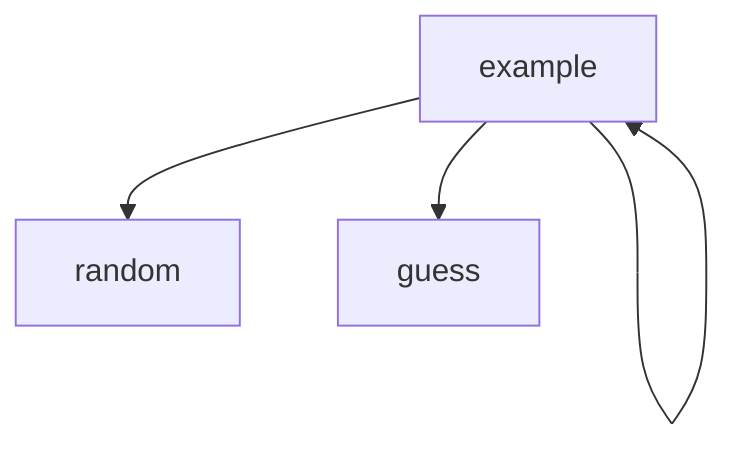

# Chapter-6-Group-Project
Jamie, Anthony, Evan
## Number Guessing Game
what the game does

#Number Guessing Game
 Flowchart

#### Function Diagrams

***
| `main()`    |               |   name     |
| ------------------ | ------------- | ----------- |
| `random:integer`    | takes input for what  |              |
| `    | what it does  | what it outputs         |
| `     |  | what it returns |
***
| `menu()`    |               |   name     |
| ------------------ | ------------- | ----------- |
| `random:integer`    | takes input for what  |              |
| `    | what it does  | what it outputs         |
| `     |  | what it returns |
***
| `add()`    |               |   name     |
| ------------------ | ------------- | ----------- |
| `random:integer`    | takes input for what  |              |
| `    | what it does  | what it outputs         |
| `     |  | what it returns |
***
| `edit()`    |               |   name     |
| ------------------ | ------------- | ----------- |
| `random:integer`    | takes input for what  |              |
| `    | what it does  | what it outputs         |
| `     |  | what it returns |
***
| `delete()`    |               |   name     |
| ------------------ | ------------- | ----------- |
| `random:integer`    | takes input for what  |              |
| `    | what it does  | what it outputs         |
| `     |  | what it returns |
***
| `search()`    |               |   name     |
| ------------------ | ------------- | ----------- |
| `random:integer`    | takes input for what  |              |
| `    | what it does  | what it outputs         |
| `     |  | what it returns |
***
| `display()`    |               |   name     |
| ------------------ | ------------- | ----------- |
| `random:integer`    | takes input for what  |              |
| `    | what it does  | what it outputs         |
| `     |  | what it returns |
